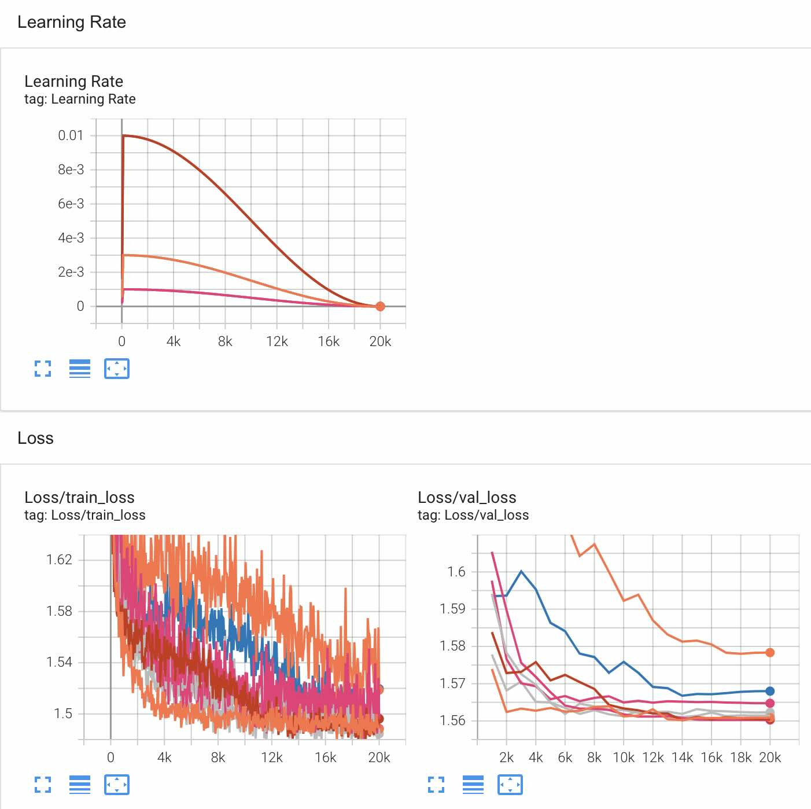
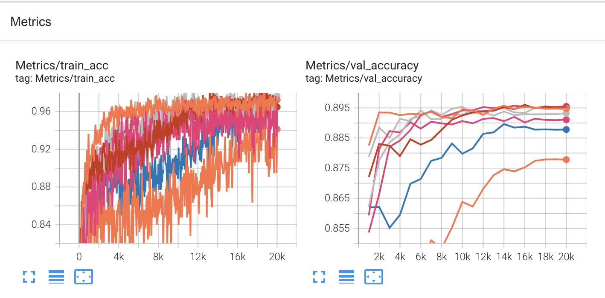
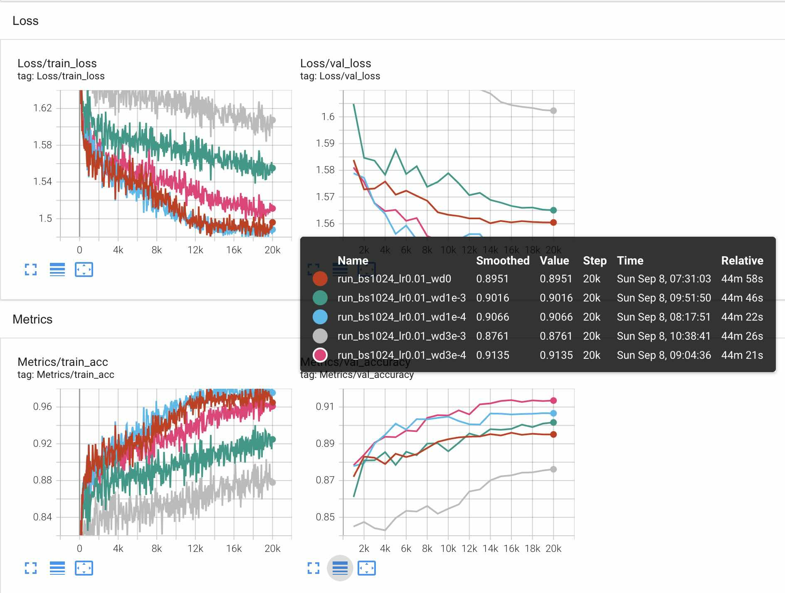
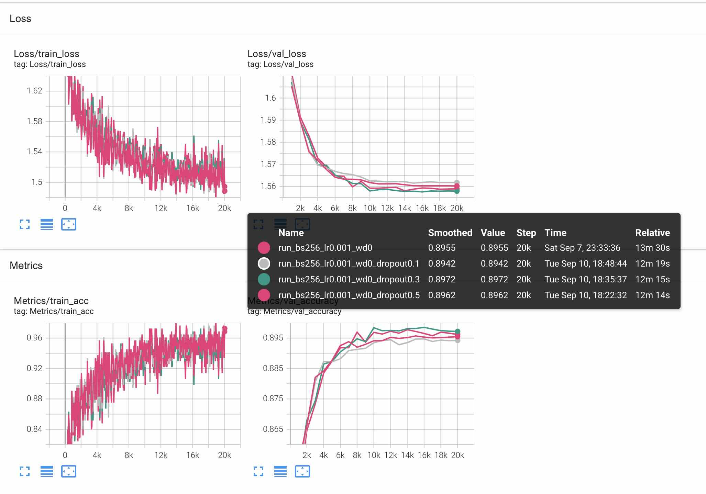

# ReadMe

## Train

Use `train.py` to train a model and set hyper-parameters.

```sh
python train.py \
    --batch_size bs \		# batch_size
    --run_name run/your_name \	# dir to store tensorboard log
    --epoch 5000 \			# max epoch
    --train_steps 20000 \	# max steps
    --test_steps 500 \		# test interval
    --save_steps 5000 \		# model save interval
    --log_steps 50 \		# log interval
    --warmup_steps 100 \	# lr warm-up
    --save_dir ./save \		# model save dir
    --lr 0.003 \			# learning rate
    --weight_decay 0		# weight decay
    --gpu 0 \				# gpu device
    --use_batch_norm \		# whether to use batch norm
    --use_drop_out \		# whether to use dropout
    --drop_out_prob 0.5		# dropout probability
    --test_curve			# whether to run on test set
```

## Test

To load a checkpoint and test, use `test.py` as 

```sh
python test_fashion.py --ckpt /path/to/checkpoint
```

## Hyper-param Searching

### Learning Rate & Batch Size





### Weight Decay



### Dropout



## Result

 
